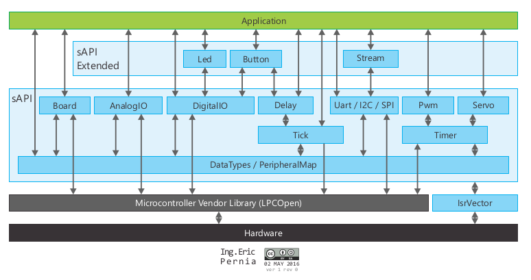

# Principios de diseño de la biblioteca sAPI

*Para desarrolladores.*

## Capas de software

El modelo de la biblioteca se compone de las siguientes capas:

- **Libraries** Bibliotecas de manejo de diferentes características.
- **Board:** Contiene las definiciones de conectores (pines, borneras, otros conectores) y la asociación con cada IPCore (cada IPCore ocupa uno o más conectores).
- **SoC**: Conjunto de IPCores.
- **IPCores:** IP Cores genéricos dentro de un SoC o externos. Por ejemplo,todos los periféricos del microcontrolador.
- **DataTypes:** Tipos de datos.

**Imagen sin actualizar:**



## IP Core

Se basa en definir IP Cores abstractos lo más genéricos posibles, logrando
independencia de la arquitectura. Esta independecia es deseada para que actúe
como HAL (Hardware Abstraction Layer). De esta manera, la capa de IP Cores 
deberá ser portada a los distintos microcontroladores a soportar.

### Tipos de IP Core

Se diferencian dos tipos de IPCores, los IP Cores solamente "inicializables", y
los IP Cores "creables e inicializables".

- **IP Cores solamente inicializables**: 
Modelan peiféricos con existencia física en el SoC. Estos periféricos no son
"creables", solamente son "inicializables", además, tienen definidos nombres
prefijados que no se pueden destruir o crear dos veces. Es decir, no se puede,
por ejemplo, tener 10 SPI apuntando al mismo elemento fisico; SPI0, es SPI0 
desde que el software arranca hasta que termina o se destrulle el chip.

- **IP Cores creables (instanciables) e inicializables**: 
Estos modelan periféricos conectados al la placa a utilizar, como por ejemplo,
un chip conectado al I2C o al SPI. También incluyen periféricos "virtuales",
como un I2C por software que para funcionar utiliza GPIOs.
La característica distintiva de este tipo de módulos es que se deben asignar
estructuras específicas porque no existen hasta que se "crean" (instancian) e
"inicializan" (análogo al new de C++).

De esta manera, para GPIO, I2C, SPI, UART, o cualquier otro periférico físico,
basta con que el nombre asignado por el CORE/BSP, para uno externo, hay que
crear su espacio en memoria (por ejemplo, con una estructura 
``eepromi2c_t eeprom1;``), luego inicializarlo y finalmente usarlo.

### Propiedades de IP Core

Cada uno de los IP Cores tendrá un conjunto de "propiedades". 

Estas propiedades se agrupan en una estructura asociada al periférico. La
estructura es el área donde se encuentra mapeado el IPCore y no es accesible
desde el API pública más alla de como un indice con nombre (I2C0=0, SPI1=1,
UART4=3, etc.).

### Tipos de datos de IP Core

Cada uno de los IP Cores tendrá un conjunto de "tipos de datos difinidos". 

Estos tipos de datos modelan, entre otras cosas, la estructura que contiene las
propiedades asociadas al periférico así como otros necesarios. Esta es de la
forma:

```c
typedef struct{
   <type> property1;
   <type> property2;
   ...
} <IpCore>_t`` 
```

También existe el tipo enumerado asociado al nombre del periférico (para
acceder por nombre a los periféricos físicos). Este tipo es de la forma:

```c
typedef enum{
   <IPCORE0>,
   <IPCORE1>,
   ...
} <ipCoreName>_t
```

### Métodos de acceso a IPCores

- Inicializar el IPCore (enciende el IPCore de ser necesario y lo inicializa con la configuración más típica utilizada): ``<ipCore>Initialize( <IPCOREi>, <mostCommonPropertyValue> | <MODIFY_FLAG1> | ... | <MODIFY_FLAGn> );
``

- Asignar valor de una propiedad: ``<ipCore>Set<PropertyName>( IPCORE<i>, <propertyValue> | MODIFY_FLAG1 | MODIFY_FLAG2(value) | ... | MODIFY_FLAGn );``

- Obtener valor de una propiedad: ``<propertyValue> = <ipCore>Get<PropertyName>( <IPCOREi> );``

- Ejemplo de cambio de una propiedad teniendo en cuenta el valor previo:``<ipCore>Set<PropertyName>( IPCORE<i>, <ipCore>Get<PropertyName>( <IPCOREi> ) | <MODIFY_FLAGi> );``

- Propiedades más comunes que encontraremos en un periférico:
    - configParamName: Un valor de configuración del periférico.
    - power: Para encender o apagar el IPCore.
    - value: Un valor a leer o escribir.
    - eventName: Un evento asociado al periférico (interrupción u otro).
    - eventNameCallback: Una estructura con el puentero a función y el puntero al parámetro que le pueda pasar el usuario a dicha función. (interrupción u otro).


